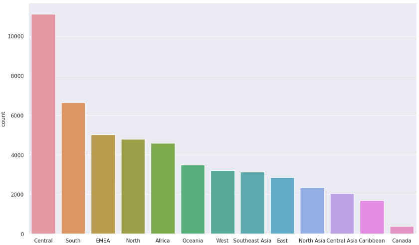

# Exploratory Data Analysis - Super Store Sales

Welcome to the Exploratory Data Analysis - Super Store Sales project! This project focuses on analyzing the sales data of a fictional super store to gain insights and inform business strategies.

## Project Highlights:
- **Understanding the Dataset:**
  - Explore the Super Store sales dataset, examining customer demographics, product categories, sales channels, and more.
- **Data Cleaning and Preparation:**
  - Perform data cleaning tasks, handle missing values, and prepare the dataset for analysis.
- **Descriptive Statistics:**
  - Calculate summary statistics to understand sales performance, including measures of central tendency, dispersion, and correlation.
- **Visualizations:**
  - Create insightful plots, charts, and graphs to showcase sales trends, patterns, and seasonality.
- **Segmentation Analysis:**
  - Segment customers based on purchasing behavior and demographics to identify target segments for personalized marketing strategies.
- **Product Performance:**
  - Analyze product sales, identify top-performing products, and explore factors influencing their success.
- **Geographical Insights:**
  - Examine sales patterns across different regions and evaluate the store's performance in specific areas.
- **Time-Series Analysis:**
  - Conduct time-series analysis to uncover seasonal patterns, forecast sales, and identify revenue growth opportunities.
- **Business Recommendations:**
  - Provide actionable insights and recommendations to optimize sales, improve customer satisfaction, and drive business growth.

Explore the project, delve into the analysis, and feel free to reach out if you have any questions or would like to collaborate on similar data-driven projects. Let's uncover valuable insights together!

*Note: This project is based on a fictional dataset and is for educational purposes only.*

## Business Understanding 

In a dynamic market with increasing demands and fierce competition, a Superstore Giant is eager to tap into your expertise. They are seeking insights on optimal strategies for success, specifically in identifying target products, regions, categories, and customer segments to prioritize or avoid. Your knowledge and analysis will be instrumental in guiding their decision-making and driving their competitive advantage.

