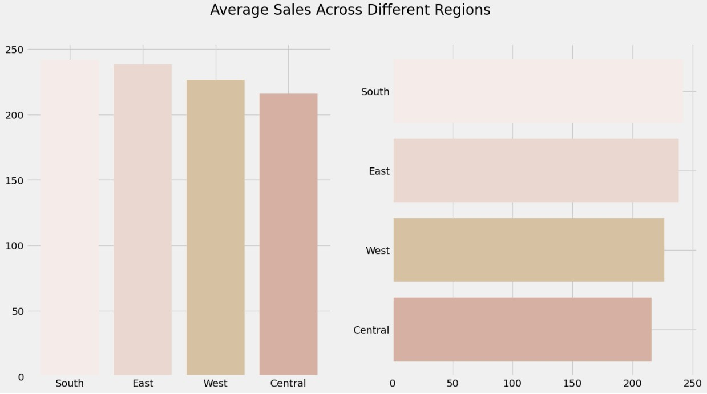
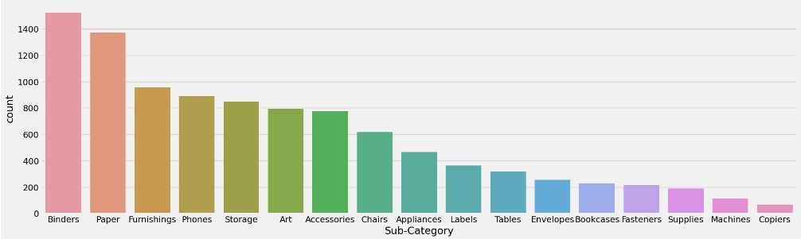
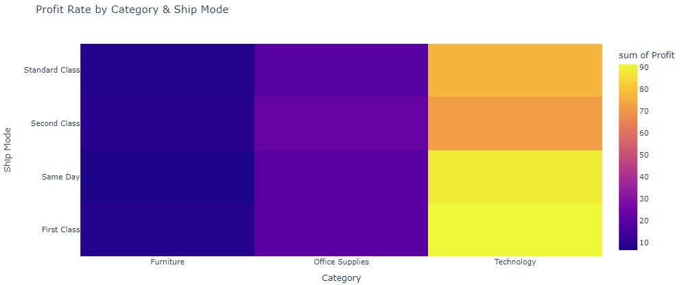

# Exploratory Data Analysis - Super Store Sales

Welcome to the Exploratory Data Analysis - Super Store Sales project! This project focuses on analyzing the sales data of a fictional superstore to gain insights and inform business strategies.

## Project Highlights:
- **Understanding the Dataset:**
  - Explore the Super Store sales dataset, examining customer demographics, product categories, sales channels, and more.
- **Data Cleaning and Preparation:**
  - Perform data cleaning tasks, handle missing values, and prepare the dataset for analysis.
- **Descriptive Statistics:**
  - Calculate summary statistics to understand sales performance, including measures of central tendency, dispersion, and correlation.
- **Visualizations:**
  - Create insightful plots, charts, and graphs to showcase sales trends, patterns, and seasonality.
- **Segmentation Analysis:**
  - Segment customers based on purchasing behavior and demographics to identify target segments for personalized marketing strategies.
- **Product Performance:**
  - Analyze product sales, identify top-performing products, and explore factors influencing their success.
- **Geographical Insights:**
  - Examine sales patterns across different regions and evaluate the store's performance in specific areas.
- **Time-Series Analysis:**
  - Conduct time-series analysis to uncover seasonal patterns, forecast sales, and identify revenue growth opportunities.
- **Business Recommendations:**
  - Provide actionable insights and recommendations to optimize sales, improve customer satisfaction, and drive business growth.

Explore the project, delve into the analysis, and feel free to reach out if you have any questions or would like to collaborate on similar data-driven projects. Let's uncover valuable insights together!

*Note: This project is based on a fictional dataset and is for educational purposes only.*

## Understanding the Data

In the context of analyzing the Super Store data, the data preparation process involves transforming the raw sales data into a format that is suitable for analysis. Here's a simplified explanation of the steps involved:

**Data Loading:** Import the Super Store sales data from the provided CSV file into a pandas DataFrame.
Handling Missing Data: Identify and handle any missing values in the dataset, either by imputing missing values or removing incomplete records.

**Data Cleaning:** Remove any irrelevant or redundant data from the dataset and correct any inconsistencies or errors.

By executing this function, the data from the CSV file is loaded into a pandas DataFrame object named 'df'. This DataFrame allows for efficient manipulation and analysis of the Super Store sales data, enabling further data preprocessing and exploration tasks to be performed, such as cleaning the data, transforming variables, or extracting relevant features for analysis.

## Analysis

To gain insights from the cleaned and prepared SuperStore data, we will focus on answering three key questions:

Q1: Who are the Top 10 Customers of the SuperStore within the Central region, and what is their profit distribution?

Q2: What are the highest-selling and lowest-selling sub-categories?

Q3: How much does each sub-category contribute to the overall sales of the SuperStore?

By answering these questions, we can gain valuable insights into the SuperStore's top customers, popular and underperforming product categories, and the overall contribution of sub-categories to sales. This analysis will provide actionable information to optimize customer targeting, product assortment, and sales strategies to drive business growth and profitability.

## Visualization: 

In the context of the superstore, the majority of sales are concentrated in the South region. However, when considering sales across all four regions in the US, the distribution is relatively even. This indicates that the South region is a significant contributor to the overall sales, but the store's presence and performance are relatively balanced across all regions. This information can be valuable for the store's strategic decision-making, such as focusing on specific areas to increase market share or exploring growth opportunities in other regions to further diversify the business and capture a broader customer base.

Upon analyzing the distribution of sales, it is evident that sales across different product categories are fairly evenly distributed. However, when focusing on profitability, a distinct pattern emerges. The technology category stands out as the most profitable, followed by office supplies in the second position. On the other hand, the furniture category appears to be the least profitable among the product segments. Understanding these profitability trends can provide valuable insights for strategic decision-making within the super store. By leveraging the success of the technology and office supplies categories and addressing the challenges in the furniture segment, the store can optimize its product assortment, marketing efforts, and resource allocation to maximize overall profitability.

Among the 17 different subcategories of products, binders emerge as the most popular category, capturing the highest sales. Following closely are paper products and furnishings, which also show strong sales performance. On the other hand, copiers rank as the least popular subcategory, representing comparatively lower sales figures. This insight can help the super store optimize its product assortment, placement, and marketing strategies. By focusing on promoting the top-selling products and analyzing factors that contribute to the underperformance of copiers, the store can further enhance its revenue generation and customer satisfaction.

Upon investigating the profitability of each product category, it is apparent that binders, bookcases, machines, and tables exhibit the highest losses. On the other hand, accessories, copiers, phones, storage, and furnishings stand out as the most profitable categories, generating substantial profits for the super store. Understanding these variations in profitability is crucial for making informed business decisions. By identifying the underperforming categories and exploring ways to improve their profitability, the super store can potentially optimize its product offerings and allocate resources more effectively. Furthermore, capitalizing on the successful categories can help drive overall profitability and lead to a more successful business model.

Upon analyzing sales and profit across different customer segments, it becomes evident that most corporate sales generate a decent profit, indicating their higher profitability compared to consumer and home office deals. Conversely, some consumer and home office deals show negative profit margins, highlighting the need to evaluate pricing and cost structures in these segments. The majority of sales fall within the $5000 sales threshold, with a corresponding profit threshold of around $2000. This information is vital for the super store to optimize its pricing and sales strategies, potentially focusing on improving profitability in the consumer and home office segments while capitalizing on the already lucrative corporate sales. By doing so, the store can aim to enhance overall profitability and business performance.

Upon examining the profitability across different categories, it is evident that technology products are the most profitable within the superstore's inventory. Additionally, when considering shipping options, the first-class and same-day shipping methods contribute significantly to the store's profit generation. By capitalizing on the success of technology products and prioritizing the first-class and same-day shipping options, the superstore can further enhance its overall profitability and cater to the preferences of its high-value customers.

In the analysis of the super store's financial data, notable losses were observed in the months of January for the years 2015, 2017, and 2018. This pattern suggests the need for further investigation to understand the underlying factors contributing to these specific downturns. By conducting a detailed examination of sales trends, customer behavior, market conditions, and any operational issues during those specific periods, the super store can gain valuable insights into the reasons behind the losses. This analysis will enable the store to make informed decisions and implement targeted strategies to mitigate future losses and improve overall performance.

## Recommendation and Summary

- Assortment Optimization:
  - Ensure a wide variety and competitive pricing for popular sub-categories like binders, storage products, art supplies, and paper.
  - Continuously monitor customer preferences and market trends to identify emerging products.

- Product Placement:
  - Strategically position popular sub-categories, such as Copiers and storage products, in high-traffic areas within the store.
  - Consider cross-merchandising opportunities to enhance the shopping experience.

- Client Relationship Strategy:
  - Build strong relationships with top customers by providing personalized experiences and dedicated support.
  - Offer tailored offerings and customized solutions based on customer needs.

- Revitalize Underperforming Sub-Categories:
  - Evaluate and revamp underperforming sub-categories like copiers, appliances, machines, and tables.
  - Conduct market research and adjust pricing strategies to generate interest.

- Customer Feedback and Engagement:
  - Actively seek customer feedback to understand preferences and pain points.
  - Implement customer engagement initiatives and loyalty programs to strengthen relationships.

In conclusion, the analysis of the Super Store data has provided valuable insights into customer behavior, product performance, and sales contributions. By identifying the top customers within the Central region and understanding their profit distribution, the Super Store can prioritize customer relationships, allocate resources effectively, and maximize profitability. Additionally, analyzing the highest and lowest selling sub-categories helps identify popular products and areas for improvement. Evaluating the sales contribution of each sub-category allows for strategic decision-making and identifying areas of strength or potential growth. The analysis provides actionable information to optimize customer targeting, product assortment, and sales strategies, ultimately driving business growth and profitability for the Super Store.
