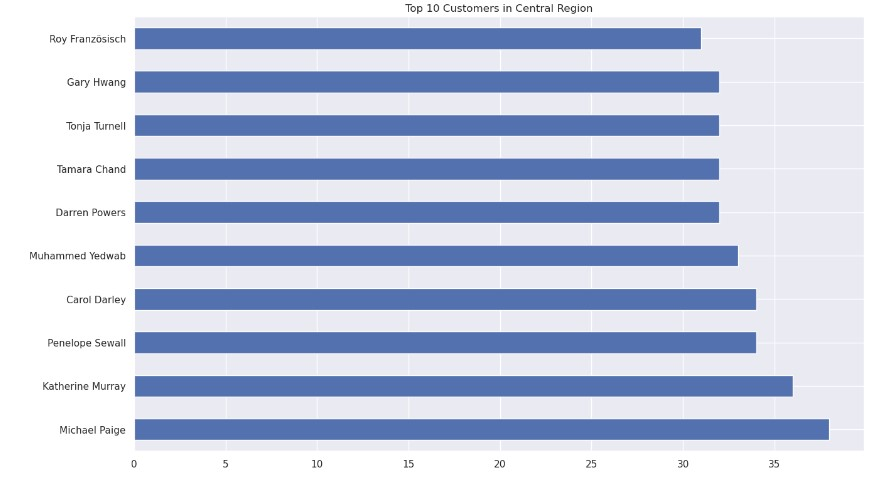

# Exploratory Data Analysis - Super Store Sales

Welcome to the Exploratory Data Analysis - Super Store Sales project! This project focuses on analyzing the sales data of a fictional super store to gain insights and inform business strategies.

## Business Understanding 

In a dynamic market with increasing demands and fierce competition, a Superstore Giant is eager to tap into your expertise. They are seeking insights on optimal strategies for success, specifically in identifying target products, regions, categories, and customer segments to prioritize or avoid. Your knowledge and analysis will be instrumental in guiding their decision-making and driving their competitive advantage.

## Project Highlights:
- **Understanding the Dataset:**
  - Explore the Super Store sales dataset, examining customer demographics, product categories, sales channels, and more.
- **Data Cleaning and Preparation:**
  - Perform data cleaning tasks, handle missing values, and prepare the dataset for analysis.
- **Descriptive Statistics:**
  - Calculate summary statistics to understand sales performance, including measures of central tendency, dispersion, and correlation.
- **Visualizations:**
  - Create insightful plots, charts, and graphs to showcase sales trends, patterns, and seasonality.
- **Segmentation Analysis:**
  - Segment customers based on purchasing behavior and demographics to identify target segments for personalized marketing strategies.
- **Product Performance:**
  - Analyze product sales, identify top-performing products, and explore factors influencing their success.
- **Geographical Insights:**
  - Examine sales patterns across different regions and evaluate the store's performance in specific areas.
- **Time-Series Analysis:**
  - Conduct time-series analysis to uncover seasonal patterns, forecast sales, and identify revenue growth opportunities.
- **Business Recommendations:**
  - Provide actionable insights and recommendations to optimize sales, improve customer satisfaction, and drive business growth.

Explore the project, delve into the analysis, and feel free to reach out if you have any questions or would like to collaborate on similar data-driven projects. Let's uncover valuable insights together!

*Note: This project is based on a fictional dataset and is for educational purposes only.*

## Data Preparation

In the context of analyzing the Super Store data, the data preparation process involves transforming the raw sales data into a format that is suitable for analysis. Here's a simplified explanation of the steps involved:

Data Loading: Import the Super Store sales data from the provided CSV file into a pandas DataFrame.
Handling Missing Data: Identify and handle any missing values in the dataset, either by imputing missing values or removing incomplete records.
Data Cleaning: Remove any irrelevant or redundant data from the dataset and correct any inconsistencies or errors.

df = pd.read_csv('/kaggle/input/superstore-sales-dataset/SuperStoreOrders.csv')

By executing this function, the data from the CSV file is loaded into a pandas DataFrame object named 'df'. This DataFrame allows for efficient manipulation and analysis of the Super Store sales data, enabling further data preprocessing and exploration tasks to be performed, such as cleaning the data, transforming variables, or extracting relevant features for analysis.

## Analysis

To gain insights from the cleaned and prepared SuperStore data, we will focus on answering three key questions:

Q1: Who are the Top 10 Customers of the SuperStore within the Central region, and how is their profit distribution?
Identify the top 10 customers based on their total purchases within the Central region.
Analyze the profit distribution among these top customers to understand their contribution to the SuperStore's profitability.

Q2: What are the highest-selling and lowest-selling sub-categories?
Determine the sub-categories with the highest sales volume to identify the most popular products.
Identify the sub-categories with the lowest sales volume to identify potential areas for improvement.

Q3: How much does each sub-category contribute to the overall sales of the SuperStore?
Calculate the sales contribution of each sub-category in relation to the total sales of the SuperStore.
Evaluate the significance of each sub-category in driving the overall revenue and identify areas of strength or potential growth.

By answering these questions, we can gain valuable insights into the SuperStore's top customers, popular and underperforming product categories, and the overall contribution of sub-categories to sales. This analysis will provide actionable information to optimize customer targeting, product assortment, and sales strategies to drive business growth and profitability.

In the context of the Super Store, sorting by region and order count reveals interesting insights about sales distribution. The analysis indicates that the Central region leads with the highest sales, followed by the South, EMEA (Europe, Middle East, and Africa), North, and Caribbean. Canada represents the region with the lowest order count. This information provides valuable knowledge about sales performance across different regions, enabling informed decision-making regarding resource allocation, target markets, and potential growth opportunities.

Exploring the top 10 customers of the SuperStore within the Central region and understanding their profit distribution is crucial for prioritizing customer relationships, maximizing profitability, allocating resources effectively, segmenting customers, and evaluating sales and marketing performance. Identifying the most profitable customers allows for tailored strategies, personalized experiences, and targeted offers, while resource allocation ensures dedicated support for key customers. Analyzing profit distribution helps segment customers by profitability, driving revenue growth through optimized marketing approaches. Evaluating the effectiveness of sales and marketing efforts enables data-driven decision-making, refining strategies, and enhancing overall business performance.

Based on the analysis of the Super Store data, it is evident that binders are the most popular sub-category, followed by storage products, art supplies, and paper. These products exhibit a strong demand among customers, indicating their importance in the store's offerings. On the other hand, sub-categories such as copiers, appliances, machines, and tables are identified as the least popular. This information highlights areas where the Super Store may need to evaluate their product offerings, marketing strategies, and customer targeting to drive sales and improve profitability. By understanding the popularity of different sub-categories, the store can make informed decisions about inventory management, promotions, and product development to align with customer preferences and maximize revenue.

## Recommendation and Summary

- Assortment Optimization:
  - Ensure a wide variety and competitive pricing for popular sub-categories like binders, storage products, art supplies, and paper.
  - Continuously monitor customer preferences and market trends to identify emerging products.

- Product Placement:
  - Strategically position popular sub-categories, such as binders and storage products, in high-traffic areas within the store.
  - Consider cross-merchandising opportunities to enhance the shopping experience.

- Client Relationship Strategy:
  - Build strong relationships with top customers by providing personalized experiences and dedicated support.
  - Offer tailored offerings and customized solutions based on customer needs.

- Revitalize Underperforming Sub-Categories:
  - Evaluate and revamp underperforming sub-categories like copiers, appliances, machines, and tables.
  - Conduct market research and adjust pricing strategies to generate interest.

- Customer Feedback and Engagement:
  - Actively seek customer feedback to understand preferences and pain points.
  - Implement customer engagement initiatives and loyalty programs to strengthen relationships.

In conclusion, the analysis of the Super Store data has provided valuable insights into customer behavior, product performance, and sales contributions. By identifying the top customers within the Central region and understanding their profit distribution, the Super Store can prioritize customer relationships, allocate resources effectively, and maximize profitability. Additionally, analyzing the highest and lowest selling sub-categories helps identify popular products and areas for improvement. Evaluating the sales contribution of each sub-category allows for strategic decision-making and identifying areas of strength or potential growth. The analysis provides actionable information to optimize customer targeting, product assortment, and sales strategies, ultimately driving business growth and profitability for the Super Store.
